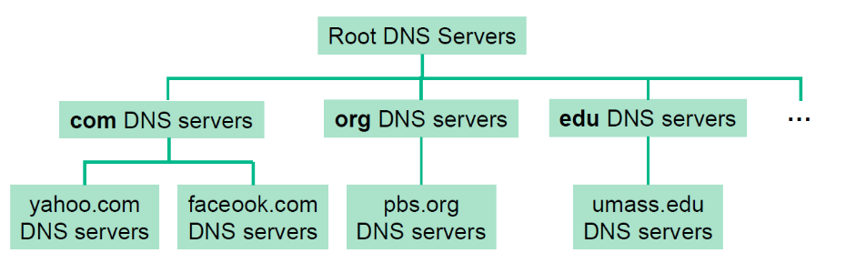

# Introduction to Computer Networks

## Table of Contents  
[Terminology](#terminology)
[Application Layer](#application-layer)  
[Transport Layer](#transport-layer)  
[Network Layer](#network-layer)  
[Link Layer](#link-layer)

## Terminology 

### End-to-end packet delay
End-to-end packet delay is the time taken for a packet to travel from source to destination.
1. Nodal processing delay
    - Check bit errors and determining output link.
2. Queueing delay
    - Time waiting in the queue for transmission. Depends on the congestion level of router.
3. Transmission delay
    - Time for bits to be pushed onto the wire.
4. Propagation delay
    - Time for bits to be delivered across the wire.

### The Open Systems Interconnection (OSI) model

Note: not complete here (there are 7 layers); learnt a simplified version.

1. **Application**:  supporting network applications, e.g.  FTP, SMTP, HTTP
1. **Transport**:  process-to-process data transfer, e.g.  TCP, UDP
1. **Network**:  routing of datagrams from source to destination, e.g.  IP
1. **Link**:  data transfer between neighbouring network elements,e.g.  Ethernet, 802.11
1. **Physical**:  bits ”on the wire”

## Application Layer

The application layer is present at the top of the OSI model. It is the layer through which users interact. It provides services to the user.

### HTTP

- Can be persistent or non-persistent
- HTTP uses TCP as transport service

### Domain Name System (DNS)

There are two ways to identify a host:
1. Hostname
2. IP address

- The DNS translates between hostname and IP address. A client must cary out a DNS query to determine the IP address corresponding to the server hostname prior to the connection. 
- Runs on UDP

If a client wants IP address for facebook.com:
1. Queries root server to find .com DNS server
2. Queries .com DNS server to get facebook.com DNS server
3. Queries facebook.com DNS server to get IP address for facebook.com

- Top level domain servers are responsible for com, org, net .... and returns a list of authoritative servers
- Authoritative servers are organisation's own DNS servers, providing authoritative hostname to IP mappings for organisation's named hosts.

### Dynamic Host Configuration Protocol (DHCP) 

- Enable devices to get IP address without any manual configuration
- This is done through a series of message exchanges between client and DHCP server

## Transport Layer

Transport Layer is the second layer of the TCP/IP model. It is an end-to-end layer used to deliver messages to a host. It is termed as an end-to-end layer because it provides a point-to-point connection rather than hop-to- hop, between the source host and destination host to deliver the services reliably. The unit of data encapsulation in Transport Layer is a segment. 

### User Datagram Protocol (UDP) 

UDP transmission is:
1. Unreliable (no error detection and recovery mechanism)
2. No connection establishment (no handshake delay)
3. Small header size

### Transmission Control Protocol (TCP)

TCP transmission:

1. TCP is connection-oriented in a sense handshaking is required before sending application data.
2. TCP supports reliable, in-order byte stream.
3. TCP also offers flow control and congestion control.

#### Three Way Handshake

1. (SYN) : In the first step, client wants to establish a connection with server, so it sends a segment with SYN(Synchronize Sequence Number) which informs server that client is likely to start communication and with what sequence number it starts segments with.
2. (SYN + ACK): Server responds to the client request with SYN-ACK signal bits set. Acknowledgement(ACK) signifies the response of segment it received and SYN signifies with what sequence number it is likely to start the segments with
3. (ACK) : In the final part client acknowledges the response of server and they both establish a reliable connection with which they will start the actual data transfer. Can piggyback.

## Network Layer 

Network layer is responsible for delivering packets to receiving hosts.  Routers will examineheader fields of IP datagrams passing it and direct it to the right destination.

### IP address

IPv4 address is a 32-bit binary integer used to identify a host. A host can get an IP address either by:
  - Manually configured by sysadmin.
  - Automatically assigned by a DHCP server.

An IP address is associated with a network interface. 
  - A host usually has one or two network interfaces (e.g. Ethernet and WiFi)
  - A router typically has multiple interfaces.

IP addresses can be public or private (specific ones are allocated):
- Private IP address of a system is the IP address which is used to communicate within the same network. Using private IP data or information can be sent or received within the same network.
- Public IP address of a system is the IP address which is used to communicate outside the network. Public IP address is basically assigned by the ISP (Internet Service Provider).

### Network Address Translation (NAT)

NAT is used by routers connecting to both local network and the internet, to translate IP addresses with the aid of port number. This is necessary since private IP addresses cannot be used for routing on the Internet.

## Link Layer

Link layer is responsible for sending datagrams between adjacent nodes over a single link.

There are two types of network links:
1. Point-to-point link: sender and receiver are connected by a dedicated link.
2. Broadcast link: multiple nodes are connected to a single broadcast channel. Collisions will occur and hence multiple access protocols are requried.

There are three broad classes of Multiple Access Protocols:
1. Channel Partitioning: divide channel into smaller partitions for exclusive use
2. Taking turns: nodes take turns to transmit
3. Random access: mechanism focuses on recovery from collision.

### Local Area Network 

#### MAC Address

- Every adaptor has a MAC address aka physical or LAN address.
- MAC address is used to send and receive link layer frames.
- MAC address is typically 48 bits long, the first three bytes of which identifies the vendor of an adaptor.

MAC address VS IP Address:
The key difference between IP address and MAC address is that IP address is dynamically assigned and hierarchical to facilitate routing, whereas MAC address is permanent for the identification of the hardware

### Address Resolution Protocol (ARP)

Protocol used to translate IP address to MAC addresses. Each IP node has an ARP table in which the mappings of IP address and MAC address of other nodes in the same subnet is stored.

### Switches 

Ethernet switch is a link-layer device used in LAN that
- Stores and forwards Ethernet frames
- Examine incoming frame's MAC addresses and selectively forward frame to one-or-more outgoing links