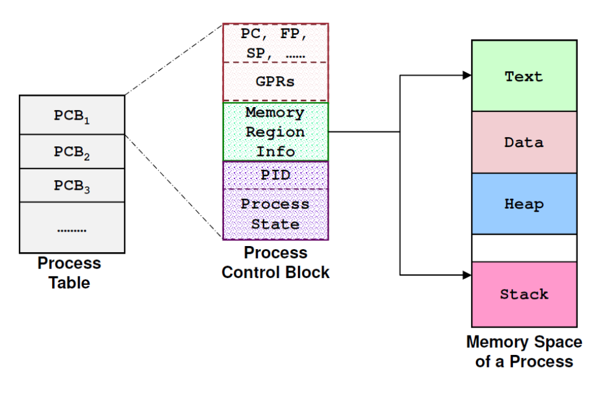
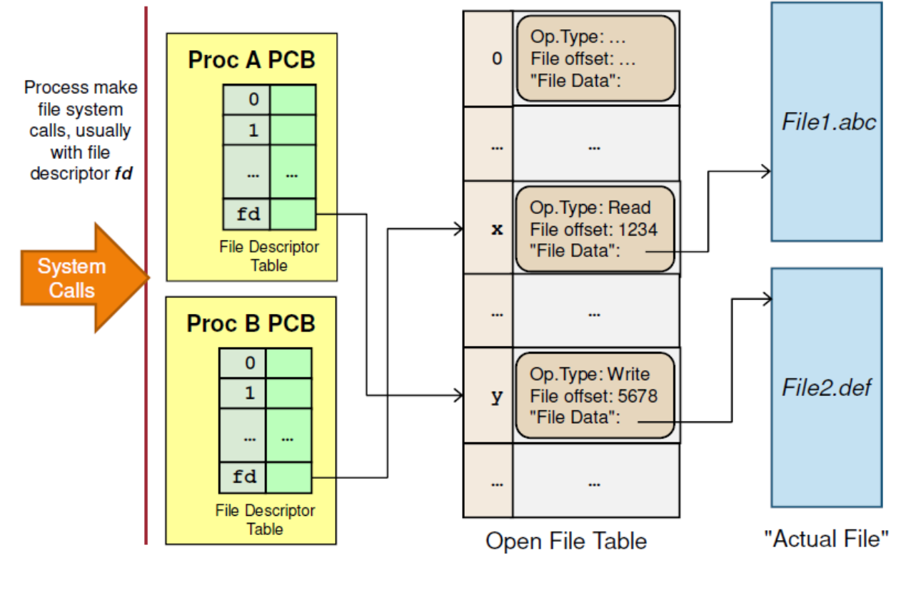

# Introduction to Operating Systems 

## Table of Contents  
[Process Abstraction](#process-abstraction)  
[Memory Abstraction](#memory-abstraction)  
[File Abstraction](#file-abstraction)  

### Difference between kernel and OS

The kernel is part of the operating system and closer to the hardware it provides low level services like:

    device driver
    process management
    memory management
    system calls

An operating system also includes applications like the user interface (shell, gui, tools, and services).

## Process Abstraction

Process/task/job is a dynamic abstraction for executing program, where information required to describe a running program is contained. The information includes three components:
  - Memory context
  - Hardware context
  - OS context

Memory Context
- Text section (instructions)
- Data section (global variables)
- Stack (memory for function calls)
- Heap (dynamically allocated memory)

The entire execution context for a process is stored in `Process Control Block`, maintained by the kernel. The PCB contains memory, hardware and process context. 

### System Calls

System calls are Application Program Interface(API) to OS, which provides ways of calling facilities/services in kernel.

### Process Creation

`fork()` is the main way to create a new process. It returns:
- PID of the newly created process for parent process, or 0 for child process

The behaviour of fork() is to create a new process called child process, which is a duplicate of the current executable image. The data in child is a copy of the parent, thus not shared. The only difference between the parent and child process are 
- Process ID(PID)
- Parent ID(PPID)
- fork() return value

### Process Termination

The UNIX convention is to `exit()` with a status 0 if the termination is normal, and non-zero if the execution is problematic

### Process Scheduling

There are two main types of process behavior:
- CPU bound
- IO bound

There are two types of scheduling policies:
- Non-preemptive: Process stays on the CPU until it finishes or is blocked.
- Preemptive: Process is given a time quota to run.

Non-preemptive scheduling algorithms:
- FCFS
- Shortest Job First

Preemptive scheduling algorithms:
- Round robin
- Priority scheduling
- Multi-level feedback queue (MLFQ)

### Threads 

A thread is an entity within a process that can be scheduled for execution. All threads of a process run in a shared memory space. Threads are way to improve application interactivity through parallelism. 

### Interprocess Communication

1. Shared Memory 
    - Shared memory is memory that may be simultaneously accessed by multiple programs with an intent to provide communication among them. Shared memory is an efficient means of passing data between programs. However, race conditions may occur if memory accesses are not handled properly. 

2. Message Passing
    - Processes communicate with each other by exchanging messages. This is done through system calls that help `send` and `receive`.  The send, receive, and reply operations may be synchronous or asynchronous. 

3. Unix Pipes
    - A pipeline is a mechanism for inter-process communication using message passing. 
    - A pipeline is a set of processes chained together by their standard streams, so that the output text of each process (stdout) is passed directly as input (stdin) to the next one. 

### Synchronisation 

- Busy waiting
- Semaphores

#### Difference between mutex and semaphore

Strictly speaking, a mutex is locking mechanism used to synchronize access to a resource. Only one task (can be a thread or process based on OS abstraction) can acquire the mutex. It means there is ownership associated with mutex, and only the owner can release the mutex.

Semaphore is signaling mechanism. It is a generalized mutex that can be used across threads/processes.

#### Deadlocks

Deadlocks occur when two or more processes wait for each other to finish and none of them ever finish. This occurs when there are multiple processes hold some resources and wait for resources held by other(s).

Conditions for deadlock:
  1. Mutual Exclusion: There is a resource that cannot be shared.
  1. Hold and Wait: A process is holding at least one resource and waiting for another resource which is with some other process.
  1. No Preemption: The operating system is not allowed to take a resource back from a process until process gives it back.
  1. Circular Wait:  A set of processes are waiting for each other in circular form.

## Memory Abstraction

The operating system abstracts away memory management from the user processes. User processes think that its memory is contiguous, but this is dependent on the operating system's implementation. 

Process memory space can be indisjoint physical memory locations. This can be done via paging or segmentation.

### Paging 

- The physical memory is split into regions of fixed size, known as physical frame.
- The logical memory, which has same size as physical, is also split into regions of same size, known as logical page. 
- At execution time, pages of a process are loaded into any available memory frame. The process will still occupy a contiguous logical memory space.
- A mapping of logical page to corresponding physical frame is kept with a page table. This is kept in the operating system memory region.
- Specialized hardware called Translation Lookaside Buffer (TLB) is used to cache a few page entries.

### Virtual Memory 

In virtual memory management, we allow logical memory space of a process to be larger than physical memory. The logical address space can either reside in physical memory or in secondary storage.

Page faults occur when pages of memory required by the process is not in memory (page table) and in the disk instead. IO operation is required to swap out pages between the memory and disk.

Thrashing is a situation when the performance of a computer degrades or collapses. Thrashing occurs when a system spends more time processing page faults than executing transactions. As the page fault rate increases, more transactions need processing from the paging device. The queue at the paging device increases, resulting in increased service time for a page fault 

## File Abstraction

File systems provides an abstraction of accessing and using the files and directories.

File operations:
  1. Create
  2. Open
  3. Read
  4. Write
  5. Seek
  6. Truncate

These operations are provided by system calls, which provide protection, concurrent and efficient access and also maintains necessary information. OS needs to keep information for an opened file in an open-file table:
  1. File pointer: current location
  2. Disk location: actual file location on disk
  3. Open count: how many processes has the file open

To keep track of these information, we need a system-wide open-file table and also per-process open-file table. The system-wide open-file table corrresponds to a unique file, whereas the per-process open-file table entry corresponds to an entry in a system-wide table.

### Links 

### Hard Links 

Hard links can only be used on files.
A hard link of a file F in directory A to another directory B makes A and B have separate pointers pointing to the actual file in disk. Deleting the file may cause problems.

### Symbolic Links

Symbolic links can be used on files and directories.
B will create a special link file G where G contains the path name of F. When G is accessed, it finds out where F is and accessed F. This solves the problem of deletion, but has larger overhead.
